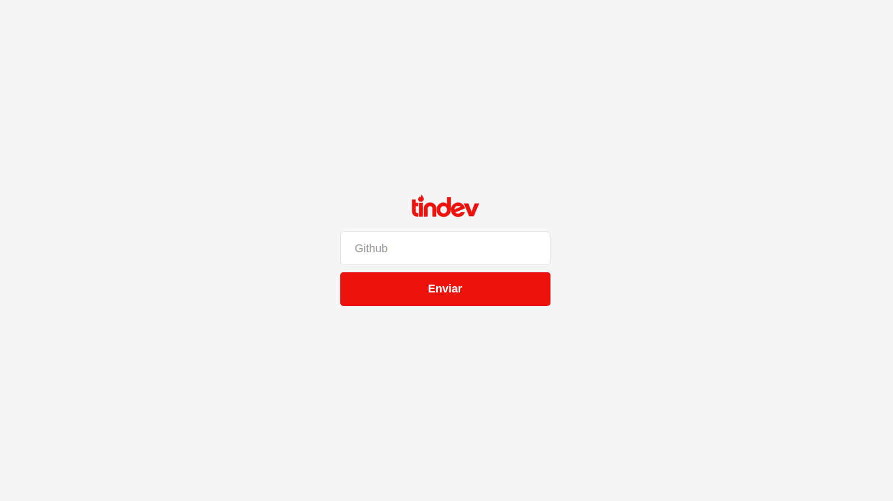

# Tindev

Tindev is an applications inspired by _Tinder_ but for developers, here you can find devs with the same interest as you.

## Install project

`cd tindev-front/`

`npm install`

`npm start`

## Login Preview

## License

[MIT License](./LICENSE.md) © [Gabriel Vacari](https://github.com/VacariGabriel)
