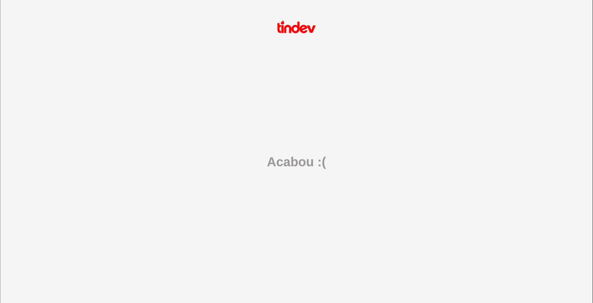

# Tindev

## Sobre a aplicação
Tindev é uma aplicaço inspirada no Tinder, o objetivo é que desenvolvedores com interesses semelhantes possam dar match para se conhecer melhor.

## Como usar ? 
Para que possa usar o Tindev, será necessário que você clone esta repositório e o repositório da API e rode localmente. O passo-a-passo esta logo abaixo.

# Execute esses comandos
`npm install`

`npm start`
  
## Divirta-se ;)
